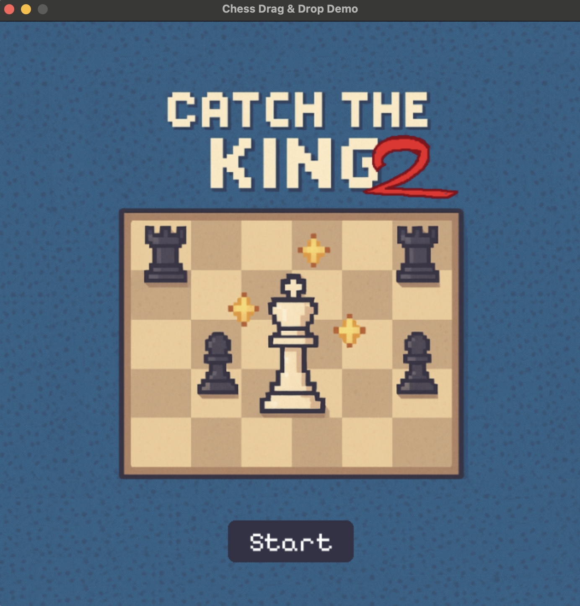
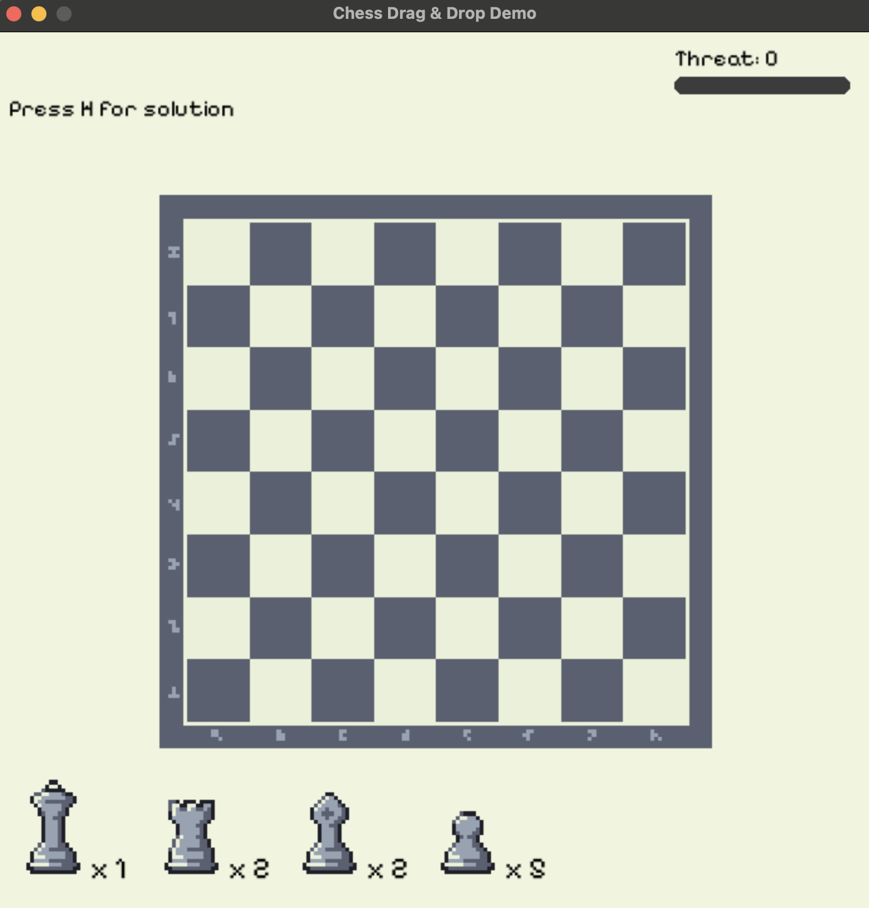
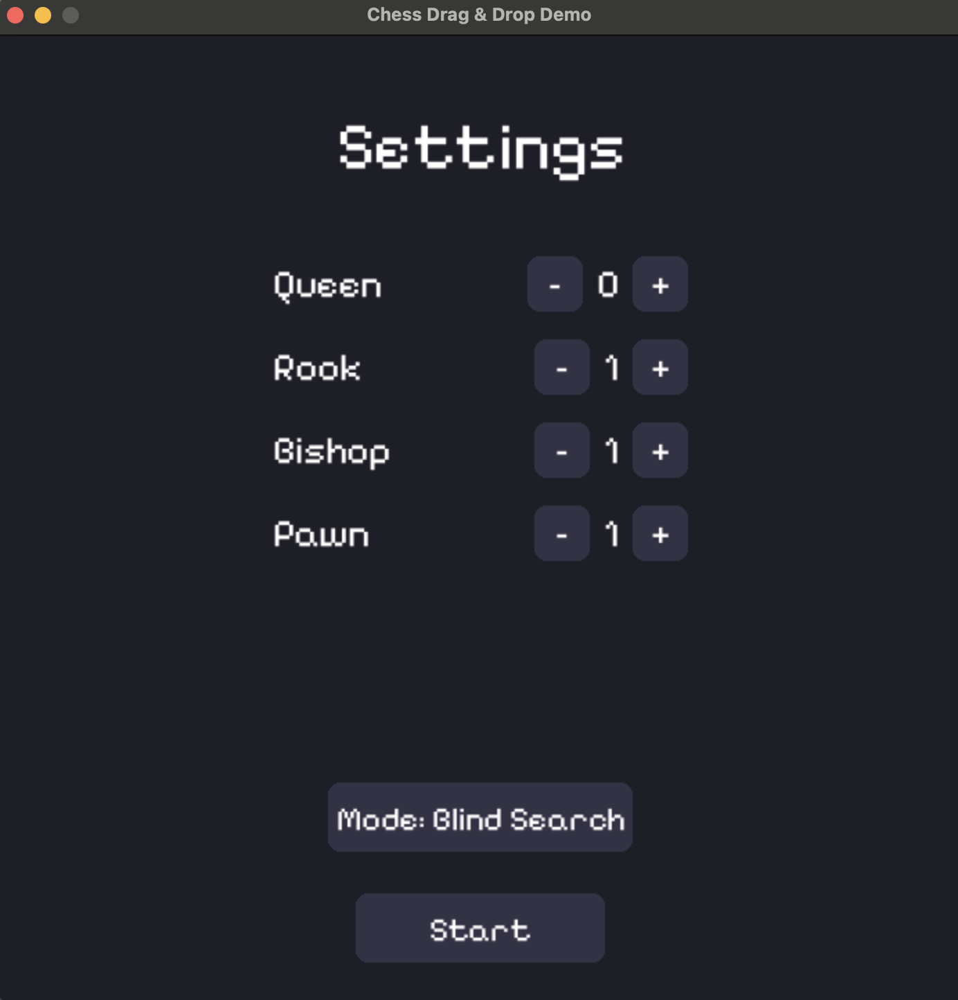
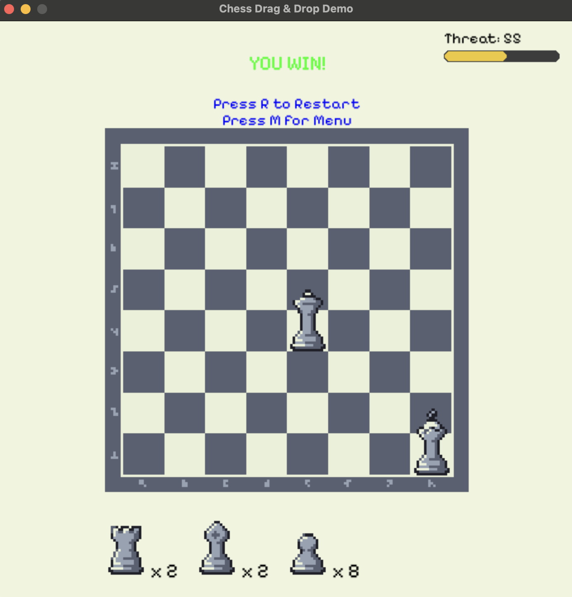
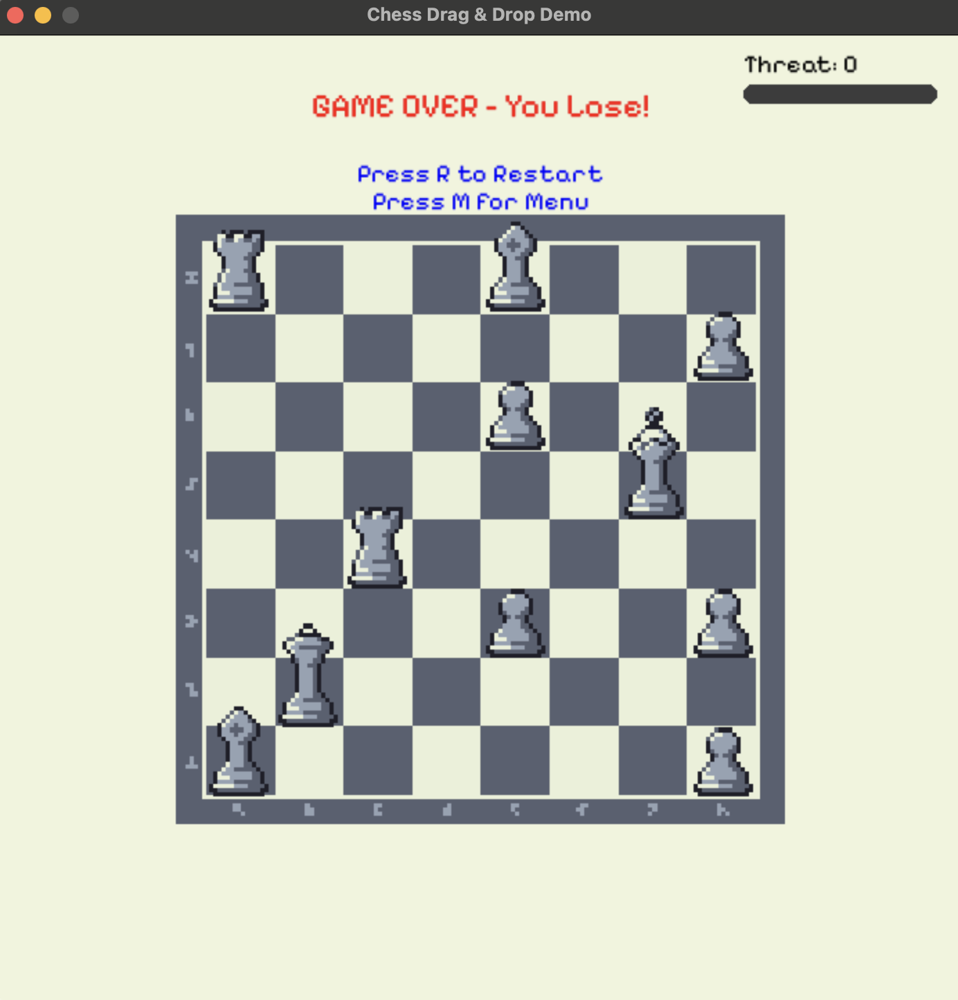

# Catch the King 👑

A chess puzzle game where you place pieces on a board to put the opponent's King in checkmate using AI-powered solvers.

## Overview

This game challenges you to create checkmate positions by strategically placing chess pieces (Queens, Rooks, Bishops, Pawns) on an 8×8 board with a fixed King position. The AI solver uses advanced search algorithms (DFS and A*) to find solutions.

## Features

- **Interactive Pygame UI** with visual piece placement
- **AI Solvers**: DFS (Depth-First Search) and A* (heuristic-guided search)
- **Checkmate Detection**: BFS and A* algorithms for validation
- **Threat Level Scoring**: Evaluates how dangerous each position is
- **Sound Effects**: Audio feedback for moves and game events

## Screenshots

<p align="center">
  
  <br/><em>Title Screen</em>
</p>

<p align="center">
  
  <br/><em>Gameplay Screen</em>
</p>

<p align="center">
  
  <br/><em>Settings Screen</em>
</p>

<p align="center">
  
  <br/><em>Win Screen</em>
</p>

<p align="center">
  
  <br/><em>Lose Screen</em>
</p>

## Getting Started

### Prerequisites
- Python 3.11+
- pip

### Installation

1. Clone the repository:
```bash
git clone https://github.com/mihiniboteju/catch-the-king.git
cd catch-the-king
```

2. Create and activate virtual environment:
```bash
python3 -m venv .venv
source .venv/bin/activate  # On Windows: .venv\Scripts\activate
```

3. Install dependencies:
```bash
pip install -r requirements.txt
```

### Running the Game

```bash
python3 Front/game_menu.py
```

## Project Structure

```
catch-the-king/
├── Back/                 # Core game logic
│   ├── solver.py        # DFS and A* search algorithms
│   ├── checkmate.py     # Check detection (BFS and A*)
│   ├── gamestate.py     # Board state management
│   └── chessgame.py     # Chess rules and piece logic
├── Front/               # UI and game interface
│   ├── game_menu.py     # Main menu
│   ├── game_main.py     # Game loop and rendering
│   └── Asset/           # Images, fonts, sounds
├── docs/                # Algorithm documentation
│   ├── DFS_WALKTHROUGH.md
│   ├── ASTAR_WALKTHROUGH.md
│   ├── CHECKMATE_BFS_WALKTHROUGH.md
│   └── CHECKMATE_ASTAR_WALKTHROUGH.md
└── tests/               # Test suites
```

## How It Works

### Search Algorithms

1. **DFS (Depth-First Search)**: Recursively explores piece placements to find checkmate
2. **A* Search**: Uses heuristic (threat score) to guide toward optimal solutions faster
3. **BFS (Breadth-First Search)**: Validates checkmate by expanding from King position
4. **A* Check Detection**: Finds nearest attacking piece with threat level scoring

### Checkmate Validation

The game uses two methods:
- `checkmate()`: Fast BFS-based boolean check
- `checkmate_astar()`: A*-based check with threat level (0-100)

See [`docs/`](docs/) for detailed algorithm walkthroughs with examples.

## Documentation

- **[DFS Walkthrough](docs/DFS_WALKTHROUGH.md)**: Step-by-step guide to depth-first piece placement
- **[A* Walkthrough](docs/ASTAR_WALKTHROUGH.md)**: Priority queue mechanics for guided search
- **[BFS Checkmate](docs/CHECKMATE_BFS_WALKTHROUGH.md)**: How check detection works with BFS
- **[A* Checkmate](docs/CHECKMATE_ASTAR_WALKTHROUGH.md)**: Threat scoring and nearest attacker search

## Contributing

Contributions welcome! See the issues page for current work.

## License

This project is open source.

## Acknowledgments

Built with Python and Pygame for AI course project demonstrating search algorithms in game applications.
